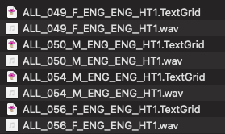
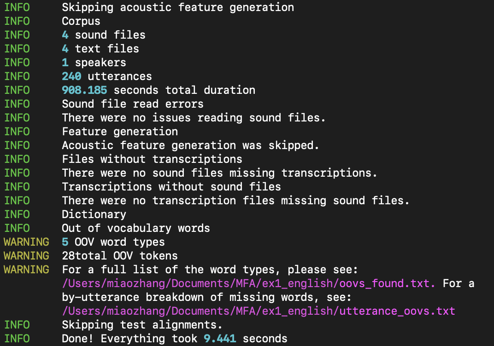
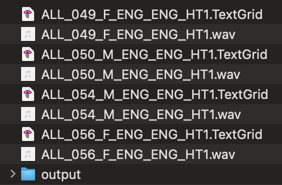

# About me

I am a linguist specializing in phonetics and phonology. I am primarily interested in any topics related to the **phonetics-phonology interface** and **phonetics-prosody interface**. I have worked on tone systems in Changsha Xiang (Sinitic), consonant-intrinsic F0 in Kansai Japanese (Japonic), voiceless nasals in Ikema (Ryukyuan). I am currently working on a project at UZH that uses large scale multilingual phonetics corpus ([VoxCommunis](https://huggingface.co/datasets/pacscilab/VoxCommunis)).

---

<!---class: center--->

# A workflow of acoustic phonetic research


1. Obtain the speech recordings (scripted or unscripted speech).

--

2. Annotate the speech data (manually, or automatically).

--

3. Extract acoustic measures (pitch, duration, formants, spectral tilts) using software for speech analysis (PRAAT)

--

4. Statistical analysis of the extracted measures (R, Python, Matlab, etc.).

--

Forced alignment is especially useful for step 2!

---

# Speech data annotation

- Given recordings of utterances, we would like to know where each individual sound starts and ends to perform further phonetic analysis.


---

The input:


---

The output:


---

# Why forced alignment?

- Manual annotation is not scalable to large speech corpora. 
  - Hand-annotate 10 minutes of recordings can easily cost more than 1 hour of work.

- Cross-annotator consistency may not be high.

- As scientists, we would like to spend more time and energy thinking about research rather than doing repetitive 'labor work' that may not be less prone to errors than algorithms.
  - Human errors are also often less *transparent* than computational errors.


---

# Before we start

## Be cautious!

Forced alignment is NOT a Swiss army knife!

- Depending on the quality and amount of the training data, the alignment might not always be 'good'.

- All machine/deep learning algorithms leak.

- Be aware of all the compromises/assumptions you have to make and live with a **good enough** outcome!

---

## Be cautious

Some cases of misuses of alignment tools which may lower the quality of your outcome:

- Using a model and dictionary trained for adult speech to align child speech.

- Using a model and dictionary for an accent or dialect that the model was not trained on. 
  - e.g., Using a model trained on American English to align British English.

- Using a model and dictionary to align speech that contains too many **unknown** words to the dictionary.

---

# Some other factors that can influence the quality of the alignment

- The quality of the pronunciation dictionary.

- The quality of the recording.

- The variability in the speakers, utterances, etc.

, etc.

_Know what your model is for and what kind of data you have!_

---

# There are many forced aligners

- [FAVE-align](https://github.com/JoFrhwld/FAVE) (and a more advanced version: [new-fave](https://forced-alignment-and-vowel-extraction.github.io/new-fave/))

- [DARLA](http://darla.dartmouth.edu/)

- [MAUS](https://www.bas.uni-muenchen.de/Bas/BasMAUS.html) (the online user interface: [WebMAUS](https://clarin.phonetik.uni-muenchen.de/BASWebServices/interface/WebMAUSGeneral))

- [CMU Sphinx](https://cmusphinx.github.io/)

, etc.

---

# Why Montreal Forced Alignment (MFA)?

- MFA allows you to train your own acoustic model with your own data.

- MFA contains grapheme-to-morpheme models as well.
 - Grapheme-to-morpheme (G2P) models are models that take the orthography as the input and output the pronunciation automatically.

That said, if you speech data is covered in the alignment tools in the previous slide, you can save the time training your own model and align your data directly.

- MFA website also contains lots of pretrained acoustic and G2P models.

But we will focus on using MFA from training your own model for your own dataset.

---

# How does MFA do this?

> "The Montreal Forced Aligner by default goes through four primary stages of training. The first pass of alignment uses <span style="color:red;">**monophone models**</span>, where each phone is modelled the same regardless of phonological context. The second pass uses <span style="color:red;">**triphone models**</span>, where context on either side of a phone is taken into account for acoustic models. The third pass performs <span style="color:red;">**LDA+MLLT**</span> to learn a transform of the features that makes each phone’s features maximally different. The final pass enhances the triphone model by taking into account <span style="color:red;">**speaker differences**</span>, and calculates a transformation of the mel frequency cepstrum coefficients (MFCC) features for each speaker."

<p style="text-align: right;">---From MFA Official website.</p>

---

# Installing MFA

MFA is installed through `conda-forge`. We will need to install [Anaconda](https://www.anaconda.com/) first.

Go to the website of Anaconda and download the one suitable to your OS (Windows, macOS, linux, etc). Installing instructions can be found [here](https://www.anaconda.com/docs/getting-started/anaconda/install#windows-installation). 


---

# Installing MFA

When Anaconda installation is successful, open your terminal (on macOS), or power shell (on Windows).

```{bash create env, eval=F}
conda create -n aligner -c conda-forge montreal-forced-aligner
```

The `aligner` flowing `-n` will be the name of the environment you create for your MFA. It can be any strings: mfa, aligner3, etc.

When the installation succeeded, use the following code to activate the environment you just created.

```{bash activate, eval = F}
conda activate aligner
```

Again, the strings following `activate` here should be the environment name you specified in previous installing command.

---

# What to prepare?

There are several things you need to prepare:

- Speech **recordings** (`.wav`, `.mp3`, etc.) with corresponding sentence-level **transcripts** (`.TextGrid`).

--

- A **pronunciation dictionary** (that shows how words are pronounced in terms of IPA or other transcription systems, e.g., X-SAMPA, ARPABET, etc.)

--

- An **acoustic model** (that represents how audio signals relate to linguistic units like phonemes or words).

---

# Use case 1 (the most simple case)

1. Recordings &#10004;

2. Transcripts &#10004;

3. Dictionary &#10004;

4. Acoustic model &#10004;

You have all preparations ready. Time to align!

---

## Recordings and the transcripts

Each recording should have a corresponding `.TextGrid` file that logs down the transcript of each utterances.



The recordings should not be too long. It is not recommended that a single recording is more than 10 minute long. 

It is recommended that each recording contains one utterance.

---

## Download from MFA database

Since MFA already contains acoustic model and dictionary for English data, we will just download them and use directly.

```{bash download from MFA, eval = F}
# Download the dictionary
mfa model download dictionary english_us_mfa

# Download the pretrained acoustic model
mfa model download acoustic english_mfa
```

---

## Format of the dictionary

The dictionary, in its simplest form, should be formatted as: 

`word w ɝ d`

on each line.

--

This format is called [CMU pronunciation dictionary](http://www.speech.cs.cmu.edu/cgi-bin/cmudict). The strings of the orthography (text-normalized) and the pronunciation of the word (phones separated by white spaces) should be tab-separated.

--

MFA dictionaries have a slightly different form that contains the probability distribution of different pronunciations of the same word.

---

## Running MFA to align

Before we actually start aligning, we need to do some sanity check first.

1. Make sure that every recording has an accompanying `.TextGrid` file.
2. Make sure that there aren't too many unknown words (<span style="color:red;">OOV words</span>, _Out-Of-Vocabulary_).

```{bash aligning en, eval = F}
# Corpus validation
mfa validate --ignore_acoustics CORPUS_DIRECTORY english_us_mfa
```

---

## If the previous step ran successfully

You should see something like this: 



---

## MFA align

OK, since it says "There were no sound files missing transcriptions," we can proceed to align.

```{bash align, eval = F}
mfa align --clean --final_clean CORPUS_DIRECTORY english_us_mfa english_mfa
          OUTPUT_DIRECTORY
```

Usually I just put the `OUTPUT_DIRECTORY` as an "output" folder in the `CORPUS_DIRECTORY`.

For example, if my `CORPUS_DIRECTORY` is `path/to/my/corpus`, then the `OUTPUT_DIRECTORY` should just be `path/to/my/corpus/output`.

---

## If the previous code ran successfully

You should now be able to see a new `output` folder in your corpus folder like this:



