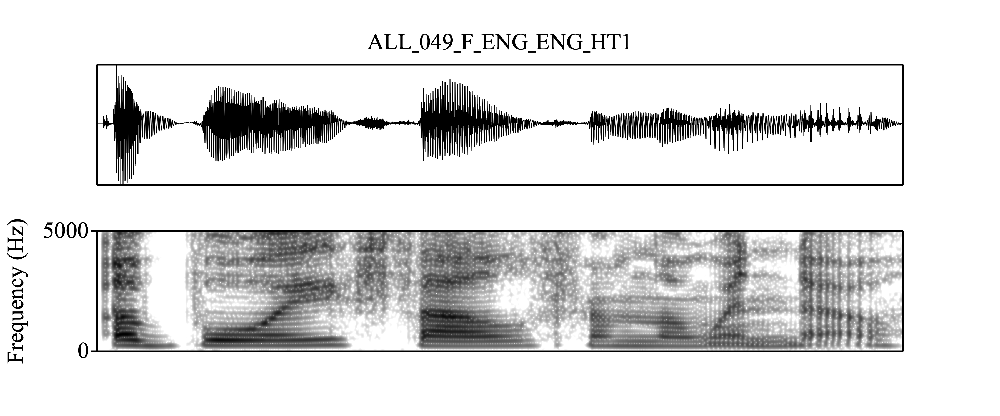

# About me

I am a linguist specializing in phonetics and phonology. I am primarily interested in any topics related to the **phonetics-phonology interface** and **phonetics-prosody interface**. I have worked on tone systems in Changsha Xiang (Sinitic), consonant-intrinsic F0 in Kansai Japanese (Japonic), voiceless nasals in Ikema (Ryukyuan). I am currently working on a project at UZH that uses large scale multilingual phonetics corpus ([VoxCommunis](https://huggingface.co/datasets/pacscilab/VoxCommunis)).

---

<!---class: center--->

# A workflow of acoustic phonetic research

1. Obtain the speech recordings (scripted or unscripted speech).

--

2. Annotate the speech data (manually, or automatically).

--

3. Extract acoustic measures (pitch, duration, formants, spectral tilts) using software for speech analysis (PRAAT)

--

4. Statistical analysis of the extracted measures (R, Python, Matlab, etc.).

--

Forced alignment is especially useful for step 2!

---

# Speech data annotation

- Given recordings of utterances, we would like to know where each individual sound starts and ends to perform further phonetic analysis.

---

The input:

---

The output:

---

# Why forced alignment?

- Manual annotation is not scalable to large speech corpora. 
  - Hand-annotate 10 minutes of recordings can easily cost more than 1 hour of work.

- Cross-annotator consistency may not be high.

- As scientists, we would like to spend more time and energy thinking about research rather than doing repetitive 'labor work' that may not be less prone to errors than algorithms.
  - Human errors are also often less *transparent* than computational errors.

---

# How to achieve this?

There are several things you need to prepare:

- An **acoustic model** (that represents how audio signals relate to linguistic units like phonemes or words).
- Speech **recordings** (`.wav`, `.mp3`, etc.) with corresponding sentence-level **transcripts** (`.TextGrid`).
- A **pronunciation dictionary** (that shows how words are pronounced in terms of IPA or other transcription systems, e.g., X-SAMPA, ARPABET, etc.)

Forced alignment reads in the speech data and the transcripts, then uses the pronunciation dictionary together with the acoustic model to identify all the sounds in an utterance.

---

# Be cautious!

Forced alignment is NOT a Swiss army knife!

- Depending on the quality and amount of the training data, the alignment might not always be 'good'.

- All machine/deep learning algorithms leak.

- Be aware of all the compromises/assumptions you have to make and live with a **good enough** outcome!

---

# Be cautious

Some cases of misuses of alignment tools which may lower the quality of your outcome:

- Using a model and dictionary trained for adult speech to align child speech.

- Using a model and dictionary for an accent or dialect that the model was not trained on. 
  - e.g., Using a model trained on American English to align British English.

- Using a model and dictionary to align speech that contains too many **unknown** words to the dictionary.

---

# Some factors that can influence the quality of the alignment

- The quality of the pronunciation dictionary.

- The quality of the recording.

- The variability in the speakers, utterances, etc.

, etc.

---

# There are many forced aligners

- [FAVE-align](https://github.com/JoFrhwld/FAVE) (and a more advanced version: [new-fave](https://forced-alignment-and-vowel-extraction.github.io/new-fave/))

- [DARLA](http://darla.dartmouth.edu/)

- [MAUS](https://www.bas.uni-muenchen.de/Bas/BasMAUS.html) (the online user interface: [WebMAUS](https://clarin.phonetik.uni-muenchen.de/BASWebServices/interface/WebMAUSGeneral))

- [CMU Sphinx](https://cmusphinx.github.io/)

, etc.

---

# Why Montreal Forced Alignment (MFA)?

- MFA allows you to train your own acoustic model with your own data.
- MFA contains grapheme-to-morpheme models as well.
 - Grapheme-to-morpheme (G2P) models are models that take the orthography as the input and output the pronunciation automatically.

That said, if you speech data is covered in the alignment tools in the previous slide, you can save the time training your own model and align your data directly.

- MFA website also contains lots of pretrained acoustic and G2P models.

But we will focus on using MFA from training your own model for your own dataset.

---

# How does MFA do this?

MFA uses [Kaldi]() ASR toolkit
