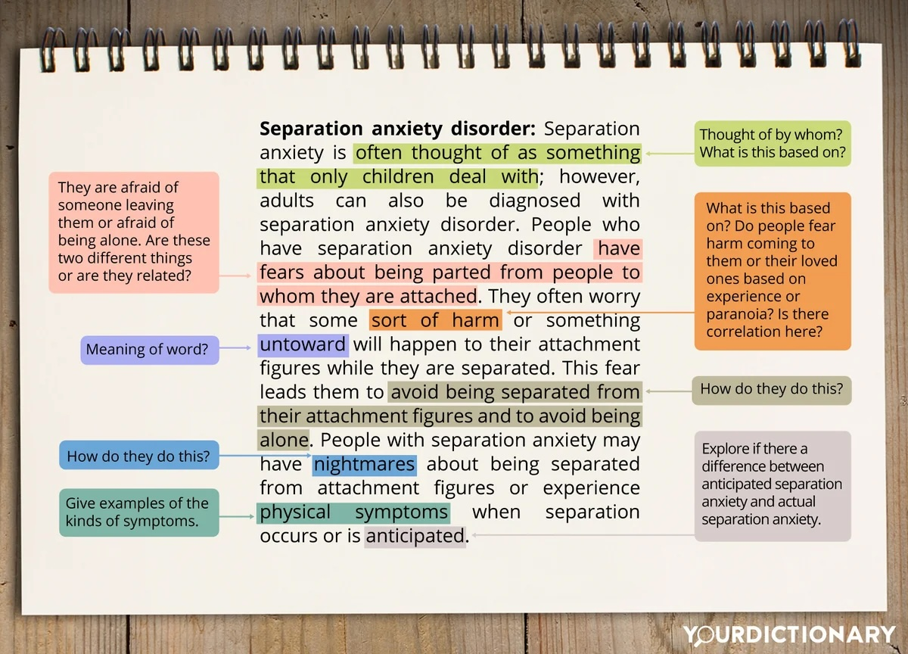
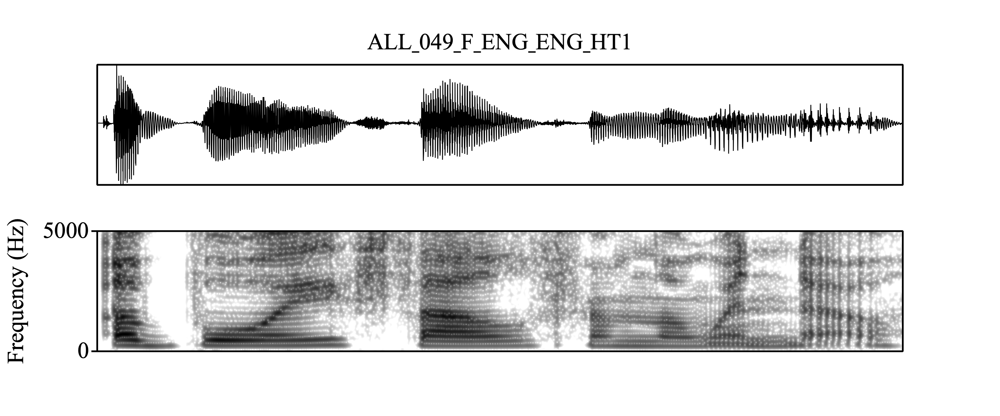
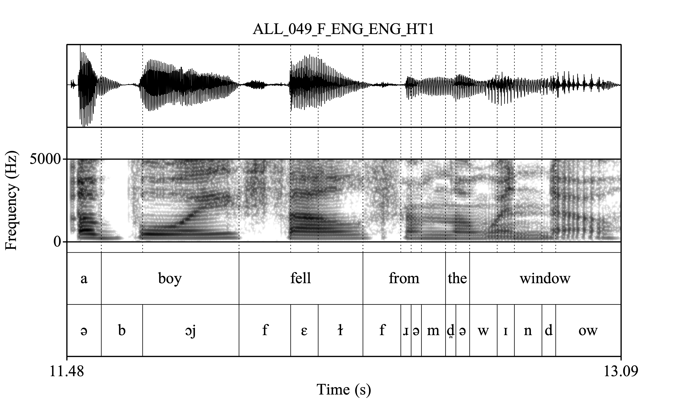
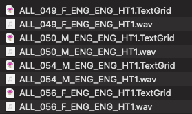
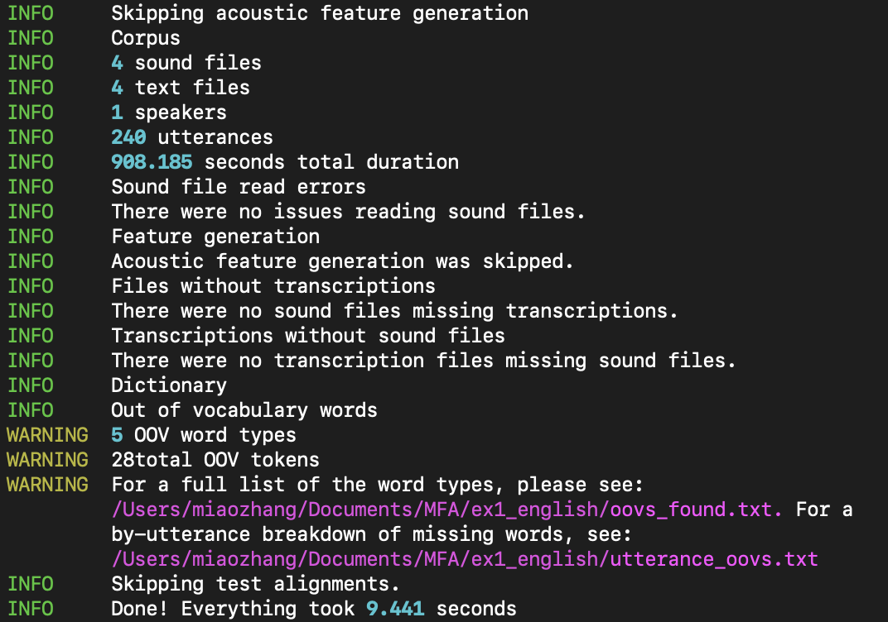
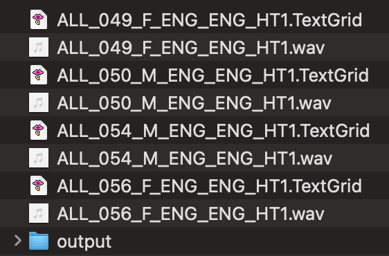
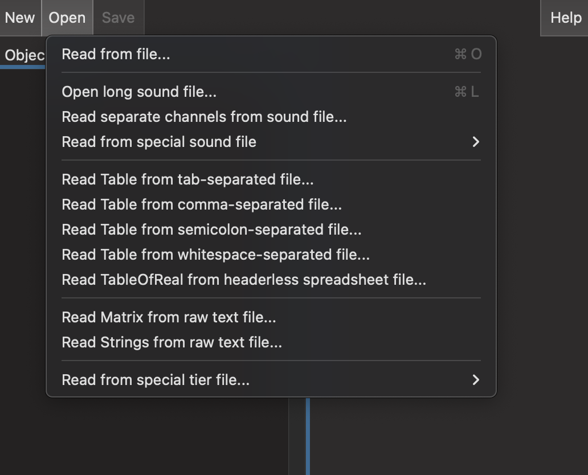
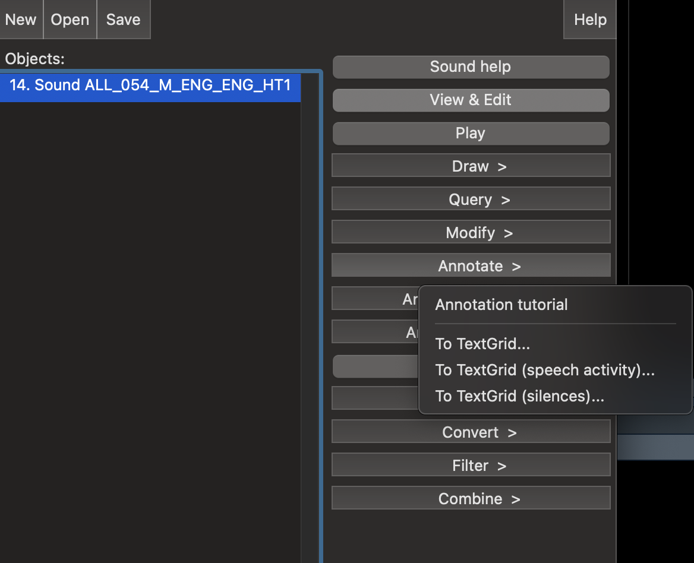
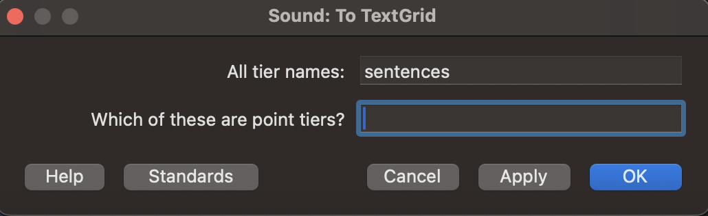
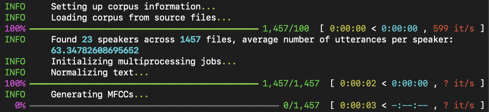

# About me

I am a linguist specializing in phonetics and phonology. 

I am primarily interested in any topics related to the **phonetics-phonology interface** and **phonetics-prosody interface**. 

I have worked on tone systems in Changsha Xiang (Sinitic), consonant-intrinsic F0 in Kansai Japanese (Japonic), voiceless nasals in Ikema (Ryukyuan). 

I am currently working on a project at UZH that uses large scale multilingual phonetics corpus ([VoxCommunis](https://huggingface.co/datasets/pacscilab/VoxCommunis)).

---

# A workflow of acoustic phonetic research

--

1. Obtain the speech recordings (scripted or unscripted speech).

--

2. Annotate the speech data (manually, or automatically).

--

3. Extract acoustic measures (pitch, duration, formants, spectral tilts) using software for speech analysis (PRAAT)

--

4. Statistical analysis of the extracted measures (R, Python, Matlab, etc.).

--

Forced alignment is especially useful for step 2!

---

# Speech data annotation

- Given recordings of utterances, we would like to know where each individual sound starts and ends to perform further phonetic analysis.



---

# The input



<div style="text-align: center;">
  <audio controls>
    <source src="ex_en.wav" type="audio/mpeg">
    Your browser does not support the audio element.
  </audio>
</div>

---

# The output



<div style="text-align: center;">
  <audio controls>
    <source src="ex_en.wav" type="audio/mpeg">
    Your browser does not support the audio element.
  </audio>
</div>

---

# Why forced alignment?

- Manual annotation is not scalable to large speech corpora. 
  - Hand-annotate 10 minutes of recordings can easily cost more than 1 hour.

- Cross-annotator consistency may not be high.

- As scientists, we want to spend more time and energy thinking about research questions rather than doing repetitive _labor_ that may not always outperform algorithm.
  - Human errors are often less *transparent* than computational errors.


---

# Before we start

## Be cautious!

Forced alignment is NOT a Swiss army knife!

- Depending on the quality and amount of the training data, the alignment might not always be 'good'.

- All machine/deep learning algorithms leak.

- Be aware of all the compromises/assumptions you have to make and live with a **good enough** outcome!

---

## Be cautious

Some cases of misuse of forced alignment tools:

- Using a model and dictionary trained for adult speech to align child speech.

- Using a model and dictionary for an accent or dialect that the model was not trained on. 
  - e.g., Using a model trained on American English to align British English.

- Using a model and dictionary to align speech that contains too many **unknown** words to the dictionary.

---

# Some other factors that can affect

- The quality of the pronunciation dictionary.

- The quality of the recording.

- The variability in the speakers, utterances, etc.

, etc.

_Know what your model is for and what kind of data you have!_

---

# There are many forced aligners

- [FAVE-align](https://github.com/JoFrhwld/FAVE) (and a more advanced version: [new-fave](https://forced-alignment-and-vowel-extraction.github.io/new-fave/))

- [DARLA](http://darla.dartmouth.edu/)

- [MAUS](https://www.bas.uni-muenchen.de/Bas/BasMAUS.html) (the online user interface: [WebMAUS](https://clarin.phonetik.uni-muenchen.de/BASWebServices/interface/WebMAUSGeneral))

- [CMU Sphinx](https://cmusphinx.github.io/)

, etc.

---

# Why Montreal Forced Alignment (MFA)?

- MFA allows you to train your own acoustic model with your own data.

- MFA website also contains lots of pretrained acoustic models, G2P models, and pronunciation dictionaries that are ready to use.
  - Grapheme-to-morpheme (G2P) models are models that take the orthography as the input and output the pronunciation automatically.

That said, if you speech data is covered by the alignment tools in the previous slide, you can save the time and align your data directly with other forced aligners.

But we will focus on using MFA.

---

# How does MFA forced align anything?

> "The Montreal Forced Aligner by default goes through four primary stages of training. The first pass of alignment uses <span style="color:red;">**monophone models**</span>, where each phone is modelled the same regardless of phonological context. The second pass uses <span style="color:red;">**triphone models**</span>, where context on either side of a phone is taken into account for acoustic models. The third pass performs <span style="color:red;">**LDA+MLLT**</span> to learn a transform of the features that makes each phone’s features maximally different. The final pass enhances the triphone model by taking into account <span style="color:red;">**speaker differences**</span>, and calculates a transformation of the mel frequency cepstrum coefficients (MFCC) features for each speaker."

<p style="text-align: right;">---From MFA Official website.</p>

---

# Installing MFA

MFA is installed through `conda-forge`. We will need to install [Anaconda](https://www.anaconda.com/) first.

 > Although the MFA website mentions that the user can just install <span style="color: red">miniconda</span>, a minimal version of Anaconda, I highly recommend installing <span style="color: red">Anaconda</span> directly. Users who use MFA sooner or later will probably need to use Python extensively as well. Anaconda builds the environment neccessary for doing data science/machine learning.

Go to the website of Anaconda and download the version suitable to your OS (Windows, macOS). Installing instructions can be found [here](https://www.anaconda.com/docs/getting-started/anaconda/install#windows-installation). 

.center[]

---

# Installing MFA

After Anaconda is installed, open your terminal (on macOS), or PowerShell (on Windows).

```{bash create env, eval=F}
conda create -n aligner -c conda-forge montreal-forced-aligner
```

The `aligner` label flowing `-n` will be the name of the environment you create for your MFA. It can be any strings: _mfa_, _aligner3_, etc.

When the installation is successful, use the following code to activate the environment you just created.

```{bash activate, eval = F}
conda activate aligner
```

Again, the strings following `activate` should be the environment name you specified in the installing command above.

---

# What to prepare to use MFA to align?

There are several things you need to prepare:

- Speech **recordings** (`.wav`, `.mp3`, etc.) with corresponding sentence-level **transcripts** (`.TextGrid`).

--

- A **pronunciation dictionary** (that shows how words are pronounced in terms of IPA or other transcription systems, e.g., X-SAMPA, ARPABET, etc.)

--

- An **acoustic model** (that represents how audio signals relate to linguistic units like phonemes or words).

---

# Use case 1 (the simplest use)

1. Recordings &#10004;

2. Transcripts &#10004;

3. Dictionary &#10004;

4. Acoustic model &#10004;

You have all preparations ready. Time to align!

---

## Recordings and the transcripts

Each recording should have a corresponding `.TextGrid` file that logs down the transcript of each utterances.



The recordings should not be too long. It is recommended that a single recording be less than 10-minute long. 

I prefer that each recording contains only one short utterance.

---

## Download from MFA database

Since MFA already contains an acoustic model and a dictionary for English speech, we will just download them from MFA and use directly.

```{bash download from MFA, eval = F}
# Download the English (US) dictionary
mfa model download dictionary english_us_mfa

# Download the pretrained acoustic model for English
mfa model download acoustic english_mfa
```

---

## Running MFA to align

Before we start aligning, we need to do some sanity check first.

1. Make sure that every recording has an accompanying `.TextGrid` file.
2. Make sure that there aren't too many unknown words (<span style="color:red;">OOV words</span>, _Out-Of-Vocabulary_).

```{bash aligning en, eval = F}
# Corpus validation
mfa validate --ignore_acoustics --no_final_clean --clean CORPUS_DIRECTORY english_us_mfa
```

---

## If the previous step ran successfully

You should see something like this: 



---

## MFA align

OK, since it says "There were no sound files missing transcriptions," we can proceed to align.

```{bash align, eval = F}
mfa align --clean --final_clean CORPUS_DIRECTORY english_us_mfa english_mfa
          OUTPUT_DIRECTORY
```

Usually I just put the `OUTPUT_DIRECTORY` with an "output" folder in the `CORPUS_DIRECTORY`.

For example, if my `CORPUS_DIRECTORY` is `path/to/my/corpus`, then the `OUTPUT_DIRECTORY` is `path/to/my/corpus/output`.

To make sure that there is no path errors, it is recommended to use full path names. A full path should start with <span style="color:red;">`~/`</span> on macOS, or <span style="color:red;">`C:\\`</span> (Or any other disks on your computer, such as <span style="color:red;">`D:\\`</span>) on Windows.

---

## If the previous code ran successfully

You should now be able to see an `output` folder created in your corpus folder like this:



---

## The result

Now you should see the result I showed in the beginning: 


---

# Use case 2:

1. Recordings &#10004;

2. Transcripts

3. Dictionary &#10004;

4. Acoustic model &#10004;

I don't have transcripts ready.

---

## Create your transcripts

It is easy to create `.TextGrid` files in PRAAT to add transcript.



---

## Create your transcripts



---

## Create your transcripts



---

## Create your transcripts

You can use [PRAAT scripting](https://www.fon.hum.uva.nl/praat/manual/Scripting.html) to bulk create `.TextGrid` files if you have a list of the transcripts of each recording.

> For a tutorial on PRAAT scripting, please check out [here](https://bookdown.org/thea_knowles/casa_coding_group/).

Once your `.TextGrid` files are ready, the rest is the same as in <span style="color: red">Use Case 1</span>.

---

# Use case 3

1. Recordings &#10004;

2. Transcripts &#10004;

3. Dictionary 

4. Acoustic model 

I don't have a dictionary yet.

---

## Create dictionary

If you can all unique words in your corpus, you can create your own dictionary.

The pronunciation dictionary should be formatted as a <span style="color: red">CMU pronunciation dictionary</span> in `.txt` or `.dict`.

A CMU pronunciation dictionary usually look like this:

```{r cmu dict, echo=F, results='asis'}
ipa_dict <- list(
  "hello" = "h ə l oʊ",
  "world" = "w ɜːr l d",
  "computer" = "k ə m p j uː t ər",
  "science" = "s aɪ ə n s",
  "example" = "ɪ ɡ z æ m p ə l",
  "dictionary" = "d ɪ k ʃ ə n ɛ r i",
  "pronunciation" = "p r ə n ə n s i eɪ ʃ ə n",
  "generator" = "dʒ ɛ n ə r eɪ t ər",
  "switzerland" = "s w ɪ t s ər l æ n d",
  "zurich" = "z ʊ r ɪ k"
)

for (word in names(ipa_dict)) {
  cat(sprintf("%s\t%s  \n", word, ipa_dict[[word]]))
}
```

Words and phones are tab-separated, whereas individual phones are white-space-separated.

---

## Use G2P to generate pronunciation

If the word list is huge, use Grapheme-to-Morpheme (G2P) tools to generate pronunciations.

Some easy-to-use G2P tools:

- [Epitran](https://github.com/dmort27/epitran)
- [XPF](https://cohenpr-xpf.github.io/XPF/)
- [CharsiuG2P](https://github.com/lingjzhu/CharsiuG2P)

---

# Use Case 3

1. Recordings &#10004;

2. Transcripts &#10004;

3. Dictionary &#10004;

4. Acoustic model 

Our dictionary is ready now! Time to train.

---

## The most important use

Yet simple to implement.

If recordings, transcripts, and the dictionary are all ready, training your own model can be done in just <span style="color: red">one line</span> in MFA.

```{bash, eval=F}
mfa train --clean --final_clean CORPUS_DIRECTORY DICTIONARY_PATH OUTPUT_MODEL_PATH 
```

> For all the MFA commands, you can type `mfa COMMAND --help` to see what options you can use. The `COMMAND` includes but is not limited to `validate`, `align`, or `train`.
---

## An example: Upper Sorbian from Mozilla Common Voice

[Mozilla Common Voice](https://commonvoice.mozilla.org/) is an online crowd-sourced multilingual dataset for automatic speech recognition.

I downloaded the Upper Sorbian dataset for demonstration, since it is relatively small with 3 hours of validated recordings.

The time it takes to train a model depends on the total length of your recordings and the power of your computer.

Training a model on a dataset with approximately 2800 hours of recordings on my computer (Macbook Pro with A3 chip and 36GB of memory) took more than 36 hours.

---

## Training

```{bash, eval=F}
mfa train --clean --final_clean /Users/miaozhang/Downloads/MFATutorial2021/hsb_v21/validated /Users/miaozhang/Downloads/MFATutorial2021/hsb_v21/hsb_xpf_lexicon21.txt /Users/miaozhang/Downloads/MFATutorial2021/hsb_v21/hsb_v21_mfa_model.zip
```

Just replace the `/Users/miaozhang/Downloads/MFATutorial2021/` with a path on your own computer.

## If it ran successfully

You should see this in your terminal/shell window: 



---

## When training is finished

You will find a `.zip` file: `hsb_v21_mfa_model.zip` in the folder.

Now you can run codes we already tried in <span style="color: red">Use Case 1</span> to align the data.

---

# The next step: acoustic analysis

We would like to use the corpus to perform more acoustic analysis, such extracting the F0, formants, duration, etc.

I created a very simple formant extraction script that you can use: `formant_simple.praat`

The script requires the directories of the <span style="color: red>recordings</span>, and the alignment <span style="color: red>output</span>. 

---

# When you have obtained the acoustic measures

You can do all sorts of analysis in R or Python...

---

# Summary

In this tutorial,

- We clarified why we need MFA and what to keep in mind upon using it.

- We then went through the installation of Anaconda and MFA.

- We learned three major uses of MFA.

To explore more of the functionality of MFA, one should refer to their [documentation](https://montreal-forced-aligner.readthedocs.io/en/latest/#).

---

class: center, middle

# Thanks for coming to the tutorial


