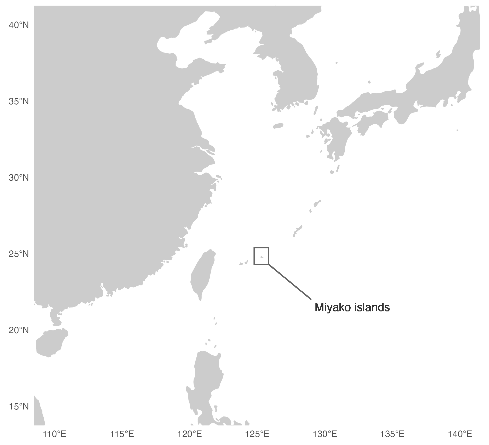
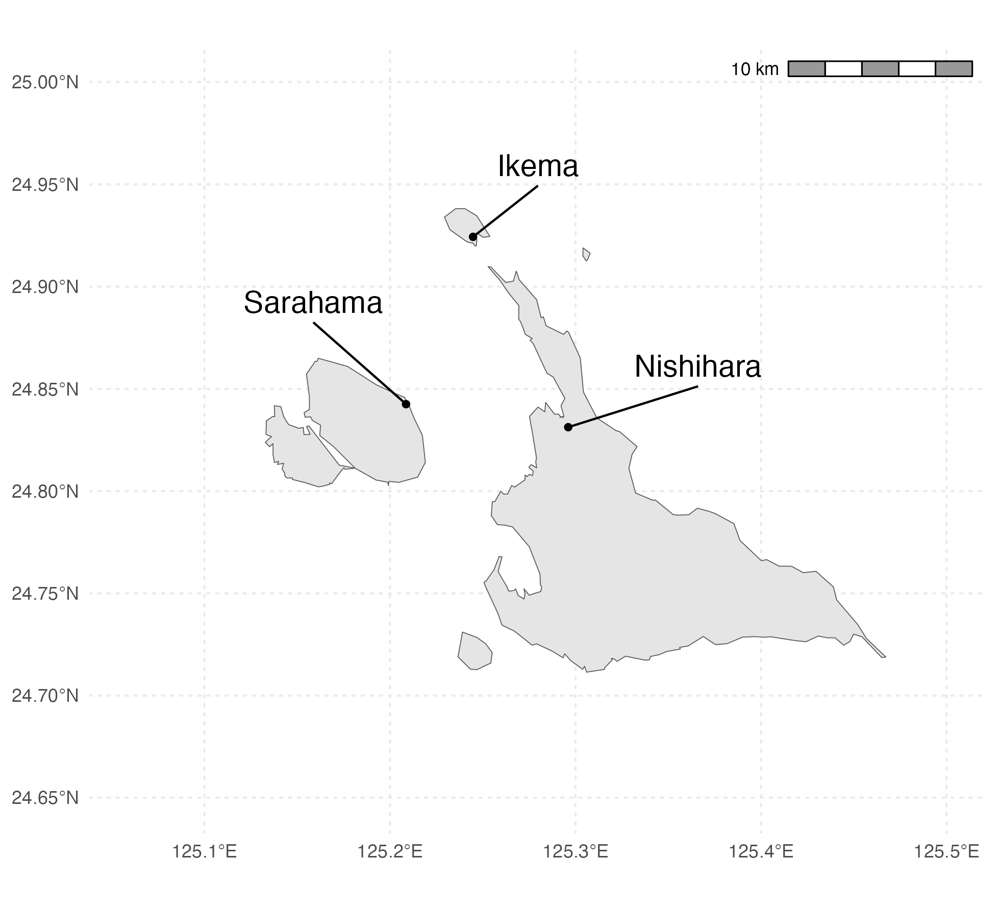
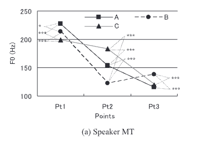
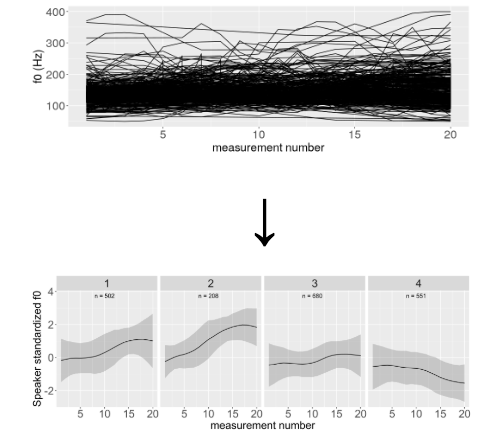
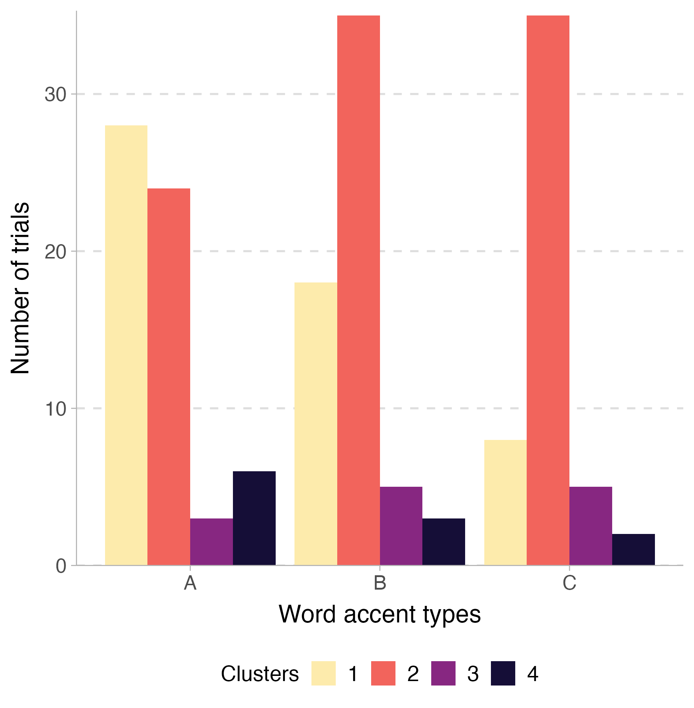
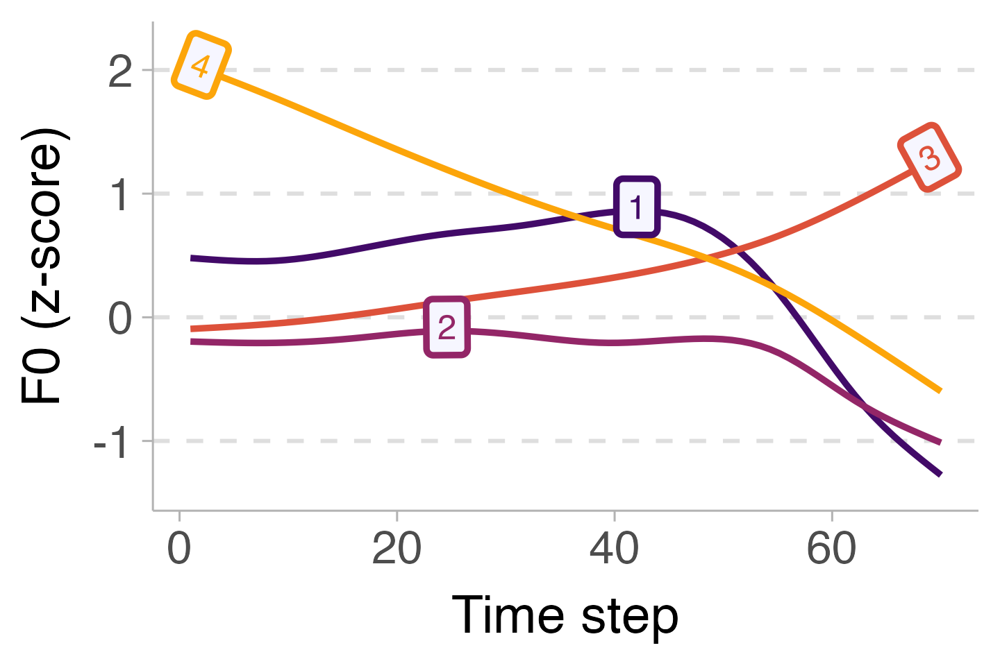
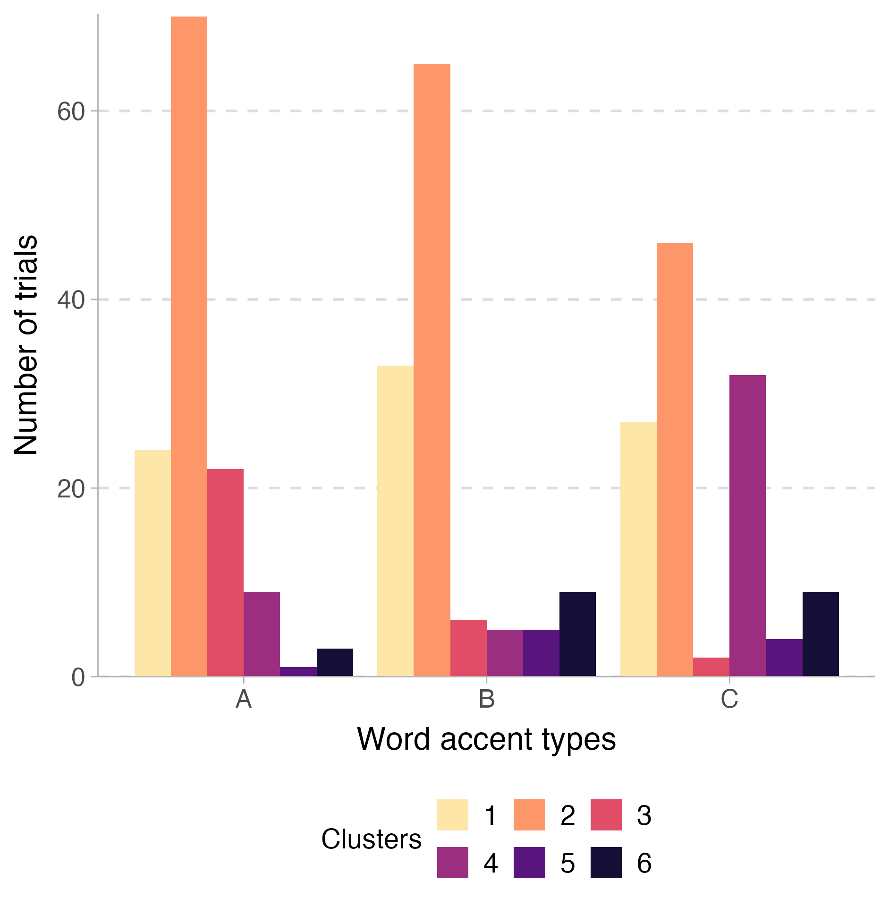
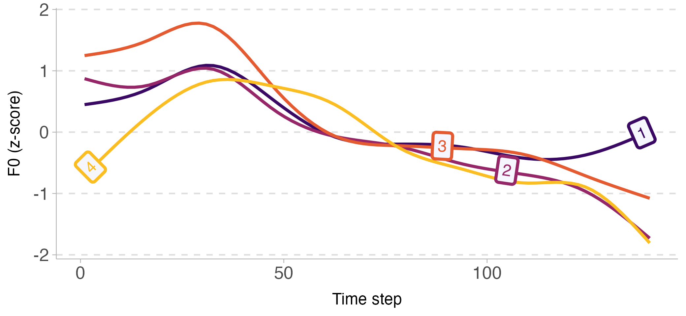
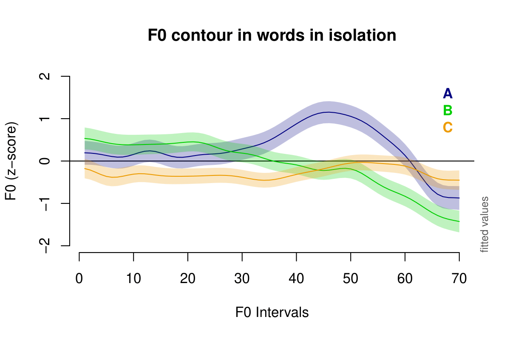
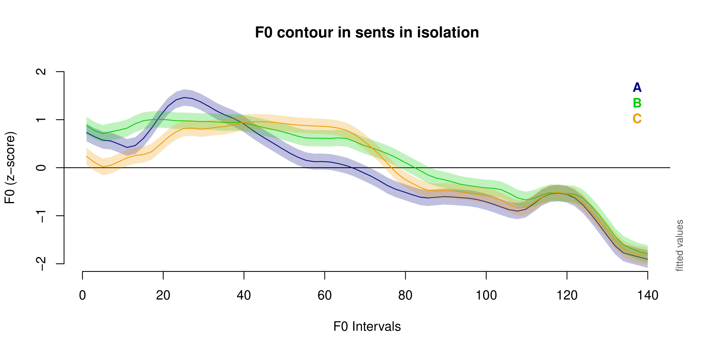

# About Ikema

```{r setup, include=FALSE}
knitr::opts_chunk$set(echo = FALSE)
```

Ikema is one of the varieties of Miyako Ryukyuan. Ryukyuan is a group of languages that forms a branch of the Japonic family (Shimoji, 2008). Ikema is spoken on Ikema Island, Sarahama (Irabu Island), and Nishihara (the main Miyako Island) in Miyakojima City of Okinawa Prefecture in Japan (Hayashi, 2010). While there are over 3,000 residents in the three areas, there are only 1,300 estimated fluent native speakers who are over 60 years old (Nakama et al., 2024).

- Japanese-Ryukyuan
    - Ryukyuan 
        - Southern Ryukyuan 
           - Miyakoan 
               - Ikema

---

class: center, middle

```{r miyako, fig.width=2}

```

---

class: center, middle

```{r ikema, fig.width=2}

```

---

# Ikema word prosody

A word accent system similar to that of Kagoshima Japanese with a fixed number of accent types across words. 

---

# Tokyo Japanese

There are N+1 different word accents depending on the number of the mora and the location of the pitch.

For example, bimoraic words have three different pitch contours: LH-L, HL-L, LH-H. (-L/H represents the pitch of the following particle within the prosodic word)

LH-H is said to not have a pitch accent and the initial L is just a boundary low tone (Beckman & Pierrehumbert 1986).

---

# Kagoshima Japanese

Kagoshima has only two types (possible pitch locations in a word) of word accents.

--

- Type A: (pitch-accent on the penultimate syllable)

  - A.me 'candy'
  - sa.KA.na 'fish'
  - ke.da.MO.no 'wild animal'

--

- Type B: (pitch-accent on the final syllable)

  - a.ME 'rain'
  - i.no.TI 'life'
  - a.sa.ga.O 'morning glory (a plant)'

(Kubozono, 2012)

---

# Word prosody in Miyakoan languages

The noun accent patterns in most Ryukyuan languages have 3 word accent types (Uwano 1997).

In most Miyakoan Ryukyuan languages, either there is no word prosodic distinctions or there are only two (Hirayama et al. 1967, Hirayama 1983).

Ikema was originally believed to have two as well (Hayashi et al. 2008).

---

# Ikema examples:

- Type A: (pitch fall at the stem boundary, -nudu is a topic/nominative particle)

  - ha.NA 'flower' 
    - haNA-nudu saKi ui. 'The flower is blooming.'
    
  - a.FU.zi 'yawn' 
    - aFUZI-nudu idi yui. 'Make a yawn.'
  
- Type B: (NO pitch fall at the stem boundary)

  - u.si 'mortar' 
    - USI-NUDU ari ui. 'There is a mortar.'
    
  - ga.ra.sa 'crow'
    - GARASA-NUDU uRI ui. 'There is a crow.'
    
---

# Igarashi et al. (2012)

Ikema has three accent types but two of them neutralize into one in isolation.

It is only distinguished when the word is embedded in a larger prosodic consistituent.

---

# Igarashi et al. (2012)

Type A:

- BU.tu 'husband'
  - buTU-**maI nyaan**. 'There's no husband either.'
  
- a.GA.i 'east'
  - aGAI-**maI nyaan**. 'There's no east either.'

---

# Igarashi et al. (2012)

Type B:

- MA.yu 'cat'
  - maYU-**mai NYAAN**. 'There's no cat either.'

- muNUi/MUNUi 'word'
  - muNUI-**mai NYAAN**. 'There's no word either.'
  
---

# Igarashi et al. (2012)

Type C:

- naBI/NABI 'pan'
  - naBI-**MAI nyaan**. 'There's no pan either'
  
- uMUI/UMUI 'thought'
  - uMUI-**MAI nyaan**. 'There's no thought either.'
  
---

# A very interesting word prosodic system where

Two types (A and B) neutralize to one in isolation.

The full contrast emerges when the word is embedded in a large prosodic constituent.

Pitch contour on the word stem *itself* is neutralized when words are *embedded*.

IF the observation holds, Ikema posit a rather interesting word-prosodic system where the lexical meaning is distinguished on constituents that are <span style="color:red">OUTSIDE</span> the word itself, while the pitch contours of the words are neutralized.

--

But!

--

<span style="color: red">Does it?</span>

---

# Igarashi et al. (2012)

They tested 121 words from the three accent types both in isolation and in sentences on three speakers.

<center>
  
</center>

The middle points: 
- **Pt1**: the highest F0 in the stem. **Pt2**: the F0 at the 80% of the particle _mai_. **Pt3**: the 50% in the predicate _nyaan_.

---

# Problems remain

So it seems it is the case, however, 

- There was only three speakers in Igarashi et al. (2012).

- Only F0 values from three specific points in an utterance is not enough to capture the contour as a whole.

- The contour may be what really matters for the accent distinction.

---

# Contour clustering

A data-driven approach of intonational patterns suitable for initial stages of prosodic research and language descriptions.

Check the out website [here](https://constantijnkaland.github.io/contourclustering/).

(Kaland, Constantijn. 2023. Contour clustering: A field-data-driven approach for documenting and analysing prototypical f0 contours. Journal of the International Phonetic Association 53(1), 159-188. doi:10.1017/S0025100321000049)

---

# Contour clustering: an example

<center>
  
</center>

---

# The problem of impressionistic descriptions

> Field researchers, often non-native speakers of the language being studied, rely heavily on their perceptual impressions and their understanding of the language. Crucially, perceptual impressions by non-native speakers are not a reliable source of information because they can be biased towards mapping form and function in ways that reflect the researcher’s native language.

it becomes a challenge to reproduce the analyses.

(Kaland, 2023)

---

# The advantage of coutour clustering

Intonation/tone data are time-series non-linear data.

Traditional clustering analysis assumes each observation is independent from each other, but in time-series data, this assumption does not hold.

Data points are highly influenced by the neighboring ones (autocorrelation).

Contour clustering instead performs clustering analysis on contours as a whole, treating each contour as an individual observation.

---

# Our study

A collaborative work with Kiyono Fujinaga-Gordon.

If Igarashi et al. (2012)'s findings were true, we should be able to detect three rather well-separated clusters even if we look into the contour data.

---

# Our study

- We found six informants.

- We tested nine bimoraic words, three from each accent types posed by Igarashi et al. (2012), both in isolation and in two carrier phrase _X-mai nyaan_ 'there is no X either.' and _X-mai ariduui_ 'there is also X.'

- We employed contour clustering analysis and GAMM to analyze the non-linear F0 contours.

---

# Target words

Type A: in (sea/ocean), butu (husband), magu (bamboo basket), 

Type B: in (dog), tuzi (wife), saba (shark), 

Type C: nsi (right/west), agu (friend), uru (red algae)

---

# Measurements

- F0 were measured in 70 intervals in isolated words, and in 140 intervals in sentence contexts.

- F0 measures were first converted into semitones, and then were z-score normalized for each speaker.

- NA values in the time series were linearly interpolated.

- The contours were smoothed with a bandwidth of 10 intervals.

- 324 contours were obtained from the word-in-isolation context, and 414 from the carrier sentence context in total.

---

# Clustering methods

The distance metric was calculated with dynamic time warping (DTW).

> Distance metric with DTW does not rely too much on the individual data points but tries to compare the overall similarity between two contours

The linkage criterion used 'complete linkage'.

> Complete linkage (farthest neighbor) uses the maximum distance between any pair of observations across two clusters. This approach tends to produce more compact, spherical clusters and is less prone to chaining. However, it can be overly sensitive to outliers and may split larger clusters prematurely if internal variance is high. 

(Wikipedia, "Hierarchical clustering")

---

# Outlier removal

To remove possible outliers, I first cut the data into 20 clusters and removed any clusters with less than 5 members.

318 contours in the isolation context and 372 in the carrier context were kept in the final analysis. 
---

# Evaluation of clusters

To evaluate the number of clusters that reached the best separation of the contours, I performed within and between cluster variation.

> It is expected that within cluster variance of the f0 contours decreases with more clusters, because with more clusters the individual contour within a certain cluster are more alike than with less clusters.

(Contour Clustering manual by Kaland)

The optimal cluster number is where <span style="color:red">the within and between variation crosses</span>.


---


# The clusering results: isolation analysis

<center>
  
</center>

---

# The clusering results: isolation analysis

<center>
  
</center>

---

class: center, middle, inverse

# The difference between the presupposed word accent types look rather gradient than categorical

---

# The clustering results: embedded analysis

<center>
  
</center>

---

# The clustering results: embedded analysis

<center>
  
</center>

---

class: center, middle, inverse

# The result is even messier than that in isolation

---

class: center, middle, inverse

# How about we just perform GAMM based on the word accent types?

---

# GAMM result: isolation

<center>
  
</center>

---

# GAMM result: carrier

<center>
  
</center>

---

# Take-aways

Well, at least it does not seem like that the three types of words are neutralized to just two contours in isolation.

But the sentence contour is very messy.

- The GAMM results showed that the three types are distinguishable both in the stem and the particle

- The cluster analysis does not support that the three are fully distinctive from each other. A

-Additionally, the clustering based on DTW and complete linkage suggests that there are more than 3 clusters, both in isolation and in carrier sentences.