## Goal

- To investigate the phonetic properties of tone sandhi in Changsha Xiang, a Sinitic language with both left- and right-dominant tone sandhi.
- To explore the possibility that the tone sandhi in Changsha Xiang reflects metrical prominence (stress) at the word level.

# Background

## Changsha Xiang

- A Sinitic language of the Xiang group.
- Spoken in Changsha, the capital city of Hunan Province, China.
- Has a 6-tone system.

## The location

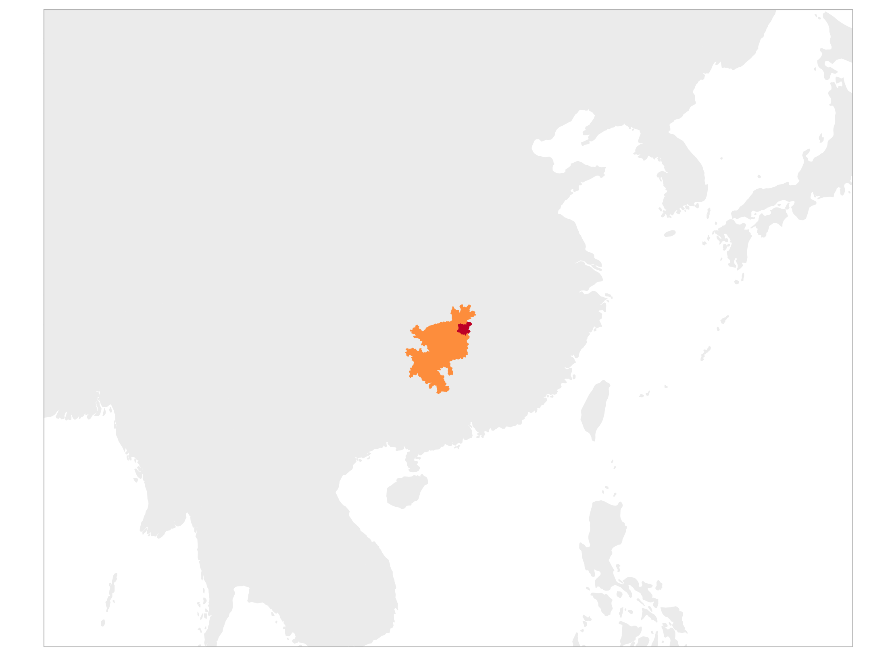{fig-align="center"}

## Changsha Xiang tones

| Tone | Tone category | Example | Meaning |
|------|---------------|---------------|---------------------|
| T13  | 阳平 Yangping      | 头 /təʊ˩˧/ | 'head' |
| T21  | 阳去 Yangqu        | 豆 /təʊ˨˩/ | 'bean' |
| T24  | 入声 Rusheng        | 毒 /təʊ˨˦/ | 'poison' |
| T34  | 阴平 Qusheng         | 都 /təʊ˧˦/ | 'capital' |
| T42  | 上声 Shangsheng        | 陡 /təʊ˦˨/ | 'steep' |
| T45  | 阴去 Yingqu       | 斗 /təʊ˦˥/ | 'fight' |

## The tones in isolation

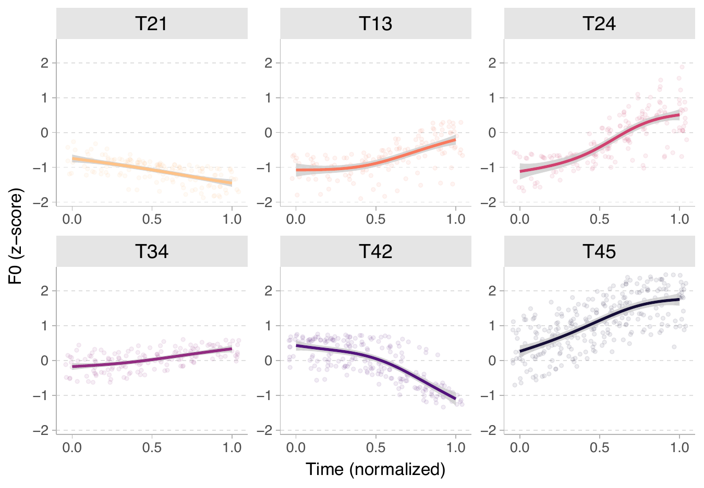{fig-align="center"}

## Sociolinguistic notes on the tones

- T13 (Yangping) and T24 (Rusheng) are merging in young speakers raised in the city, either due to similar tonal contours or due to the influence of Mandarin.
- Some T21 syllalbes are merging with T45 due to the influence of Standard Mandarin.
- The falling of T42 (T42 -> T44) is disappearing in young speakers.

## Tone sandhi in Changsha Xiang

- Tone sandhi: a phonological process where the tone of a syllable changes based on the context in which the tones occur.
- Changsha Xiang has a position-sensitive tone sandhi system, exhibiting both left- and right-dominant patterns.

## Tone sandhi in Changsha Xiang

- @Bao1998, @zhongLightTonesChangsha2003, @zhongStudyStressPatterns2007: 
    - Tones are partially neutralized and leveled in the non-dominant syllables in disyllables.
        - T45 -> T5
        - {T42, T24} -> T4
        - {T13, T34} -> T3 
        - T21 -> T2
    - *Paradigmatic neutralization* (or "*default insertion*", see @zhangDirectionalAsymmetryChinese2007), a type of tone sandhi usually found in right-dominant tone sandhis across Sinitic languages.

## Structure-dependent tone sandhi

| Structure | Word | Meaning | Tone sandhi |
|-----------|------|---------|----------------|
| Subj-pred | 牛贵 [lʲəu^13−3^.**kʷeɪ^45^**] | 'cows are expensive' | Right |
| Verb-result | 磨破 [mo^13−3^.**pʰo^45^**] |  'to wear out' | Right |
| Verb-obj | 停电 [tin^13−3^.**tʲẽ^45^**] | 'to cut off electricity' | Right |

[@linChangshaToneSandhi2011]

## Structure-dependent tone sandhi

| Structure | Word | Meaning | Tone sandhi |
|-----------|------|---------|----------------|
| Coordinative | 呈现 [**t͡sən^13^**.ɕẽ^45−5^] | 'to demonstrate' | Left |
| Modifier-head | 咸菜 [**xã^13^**.t͡sʰaɪ^45−5^] | 'salted vegetables' | Left |

[@linChangshaToneSandhi2011]

- Structure-dependent tone sandhi is also found in other Sinitic languages. 
    - E.g., Shanghai Wu [@zhangStructuredependentToneSandhi2016].

## Structure-dependent tone sandhi

A famous minimal pair:

1. 炒饭 /t͡sʰaʊ^42-4^.**fã^21^**/ 'to stir-fry rice' (V-Obj)
2. 炒饭 /**t͡sʰaʊ^42^**.fã^21-1^/ 'fried rice' (Noun)

## However,

Things are more complicated beyond disyllables.

1. 干燥 /**kã^34^**.tsʰaʊ^45-4^/ 'dry' (Coordinative)
2. 烘干 /xən^34-3^.**kã^34^**/ 'to dry' (V-Result)
3. 风干 /**xən^34^**.kã^34-3^/ 'to air dry' (Manner-V)
4. 烘干机 /**xən^34^**.kã^34-3^.t͡ɕi~z~^34-3^/ 'drying machine' (Noun)
5. 风干鸡 /**xən^34^**.kã^34-3^.t͡ɕi~z~^34-3^/ 'dry-cured chicken' (Noun)

## Tone sandhi at what prosodic level?

::: {.incremental}
- Previous documentation may have conflated word- and phrase-level tonology in Changsha Xiang.
- There are words in Changsha Xiang in which the final syllable is always dominant, **regardless** of the syllable count.
- E.g., proper nouns.
    - 文明 /**wən^13^**.min^13-3^/ 'civilization/civilized'.
    - 文明 /wən^13-3^.**min^13^**/ 'Civilization (A video game series)'.
:::

## Common noun vs. person names

This applies to person names as well.

1. 红旗 /**xɤn^13^**.t͡ɕi~z~^13-3^/ 'red flag' (Common noun)
2. 洪齐 /xɤn^13-3^.**t͡ɕi~z~^13^**/ 'Hong Qi' (Person name)
3. 洪明齐 /xɤn^13-3^.min^13-3^.**t͡ɕi~z~^13^**/ 'Hong Mingqi' (Person name)
4. 乌鲁木齐 /uᵝ^34-3^.ləʊ^42-4^.mo^24-4^.**t͡ɕi~z~^13^**/ 'Urumqi' (Place name)

I'll focus on the tone sandhi patterns in disyllabic common nouns and person names to avoid the confound of phrase-level prominence.

## Languages with both tone and stress

- Stress and tone can co-occur in the same language [@Hyman2006]. 
- Changsha Xiang tone sandhi resembles tone-stress interactions in languages such as Swedish [@riadCulminativityStressTone2012], Goizueta Basque [@hualdeLexicalToneStress2008], Lamba [@bickmoreToneStressLamba1995], Curaçao Papiamentu [@remijsenStressToneDiscourse2005], Itsunyoso Triqui [@dicanioPhoneticsPhonologySan2008], Quiaviní Zapotec [@peonInteractionMetricalStructure2010] and Serbian [@zecInteractionToneStress2010].

## Languages with both tone and stress
- In these languages, full tonal contrast is only found in the stressed syllables.
- The unstressed syllables are either toneless (Swedish, Serbian, Lamba, and Goizueta Basque) or have a reduced tonal inventory (Itsunyoso Triqui and Curaçao Papiamentu).

## Languages with both tone and stress

E.g., Itsunyoso Triqui [@dicanioPhoneticsPhonologySan2008]

- 9 lexical tones.
- Most words are disyllabic, and **final** syllables are obligatorily stressed.
- 6 tones (both level and contour tones) can occur in the final stressed syllable, 
- But only 4 level tones can occur in the initial unstressed syllables.

## Itsunoyo Triqui tones [@dicanioPhoneticsPhonologySan2008]

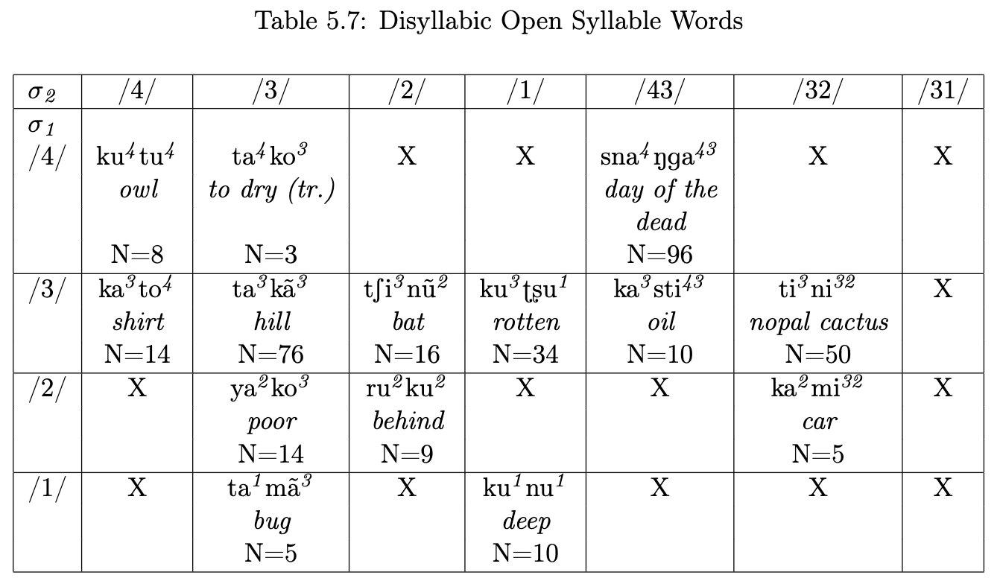{fig-align="center"}

## Phonetics of tone-stress interaction

::: {.incremental}
- Duration was found to be the most reliable acoustic correlate of stress, probably because F0 has been utilized in the language's tonal phonology.
    - Curaçao Papiamentu [@remijsenStressToneDiscourse2005; @rivera-castilloPhoneticCorrelatesStress2004], Pirahã [@everettAcousticCorrelatesStress1998], Thai [@potisukAcousticCorrelatesStress1996], Itunyoso Trique [@dicanioItunyosoTrique2010], Ixcatec [@dicanioPhoneticsWordprosodyStructuresubmitted], Kurtöp [@hyslopStressToneAcoustic2021], Central Pame [@torresWordprosodicTypologyCentral2025], Tetsǫ́t'iné [@jakerAcousticStudyTetsotine2022], Chácobo [@tallmanAcousticCorrelatesStress2020], Ei [@wangMetricalStructureTone2016] and Fuzhou [@chanFuzhouPhonologyNonlinear1985].
:::

## Phonetics of tone-stress interaction

::: {.incremental}
- In contrast, in **non-tonal** languages, F0 has been reported to be the most reliable acoustic correlate of stress [@Gordon2017].
- Changsha Xiang has already shown tonal alternation, but does it also affect duration?
- Very few studies investigated tone-stress interaction in Sinitic languages [@duanmuMetricalStructureTone1999; @zhongStudyStressPatterns2007; @duanmuMetricalTonalPhonology1995; @wrightMetricalApproachTone1983]. 
- Even fewer studies have explored its phonetic properties [@guoPhoneticRealizationsMetrical2022; @wenDisyllabicToneSandhi2023; @huKeyAcousticCues2024; @wangMetricalStructureTone2016; @suiInteractionMetricalStructure2016; @qingAnalysisDisyllabicTone2014].
:::

## Phonetics of tone-stress interaction in Sinitic languages

Positive evidence:

- Standard [@suiInteractionMetricalStructure2016] and Chengdu Mandarin [@LiuliuLunShengDiaoYuYanDeJieZouYuChongYinMoShiSpeechRhythm2022]: Initial dominant syllables are longer.
- @guoPhoneticRealizationsMetrical2022: Dominant syllalbes are longer in Changsha Xiang (initial), Xiamen min (final), and Fuzhou min (final) but not in Chengdu Mandarin (initial).
- @huKeyAcousticCues2024: Dominant syllables are longer in Chongqing Mandarin (initial), Kunming Mandarin (final), and Xiamen Min (final).

## Phonetics of tone-stress interaction in Sinitic languages

Negative evidence:

- @wenDisyllabicToneSandhi2023: Dominant syllables are **not** longer in Shaoxing Wu.
- @hsiehExistenceWordStress2021: Metrical prominence is not perceptually salient in Standard Mandarin.

## Research questions

- Stressed syllables should show:
    - **longer** duration, 
    - **more distinct** tonal contrast,
    - **less** tonal coarticulation.

## Research questions

Specifically, we ask the following questions:

::: {.incremental}
- How does tone sandhi affect duration?
- How does tone sandhi affect tonal production and coarticulation in terms of F0 contour?
- Can we observe tonal simplification (neutralization and leveling) in non-dominant syllables in phonetics?
:::

# Methods

## Speech materials

- For common noun trials, 4 sets of disyllabic words were created as the target words, with each set containing 36 words for each of the tonal combinations (144 in total). 
- For person-name trials, 2 distinct sets of disyllabic person names were used (72 in total).
- Exp 1 tested only the person names, while Exp 2 tested only the common nouns.
- Each trial is repeated twice in Exp 1, while four times in Exp 2.

## Participants

- 16 native speakers of Changsha Xiang.
- Participants have to have grown up and currently live in Changsha, and have to be able to distinguish T13 and T24 in order to be included in the study.
- 7 of the 16 participants completed both experiments, with 12 participants in each Exp.

## Recording procedure

- Recording took place in participants' homes using a Zoom H4n recorder and a Shure SM35 headset condenser microphone.
- They are instructed to read the trial sentences shown on a computer screen at a normal pace, and to repeat the sentences if they make any mistakes.

## Data extraction

- Syllable and rhyme boundaries were manually annotated in Praat.
- Syllable duration was measured from the annotated boundaries.
- F0 was extracted from 10 equidistant points in the rhyme of each syllable, and normalized into z-scores for each speaker.
    - F0 values that are more than 2sd away from the speaker's mean were excluded as outliers.

## Data analysis

- Linear mixed-effects models (LMM) were used to analyze the effects of tone sandhi on syllable duration.
- Generalized additive mixed-effects models (GAMM) were used to analyze the effects of tone sandhi on 1) tonal production and 2) coarticulation.
- GAMMs were fit separately for each tone in both analyses.

See details of the models in my paper: @zhangToneSandhiTonal2026.

## Data analysis

To investigate tonal coarticulation, I encoded T45 and T21 as H and L tones in the initial and final syllables.

## Data analysis
- Linear Discriminant Analysis (LDA) was used to analyze the tonal merging and leveling patterns.
- To perform LDA, each f0 contour is fit with a cubic polynomial regression, and the coefficients of the fitted polynomial are used as features for LDA.
- The mean intensity of each syllable and the syllable duration were also included.

See details of the models in my paper: @zhangToneSandhiTonal2026.

# Results

## Syllable duration

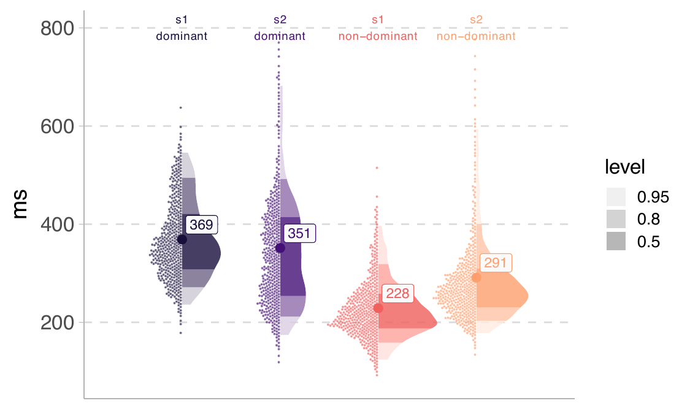{fig-align="center"}

## Syllable duration

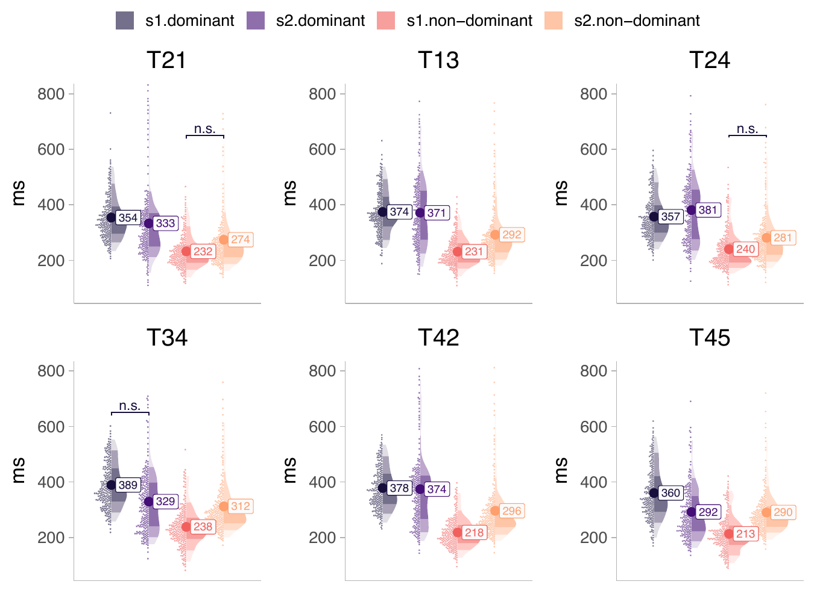{fig-align="center"}

## Findings on syllable duration

- There is always a difference between dominant syllables and non-dominant syllables across all tones.
- The only insignificant difference is dominant or non-dominant syllable-internal comparisons.

## GAMM results on tonal production

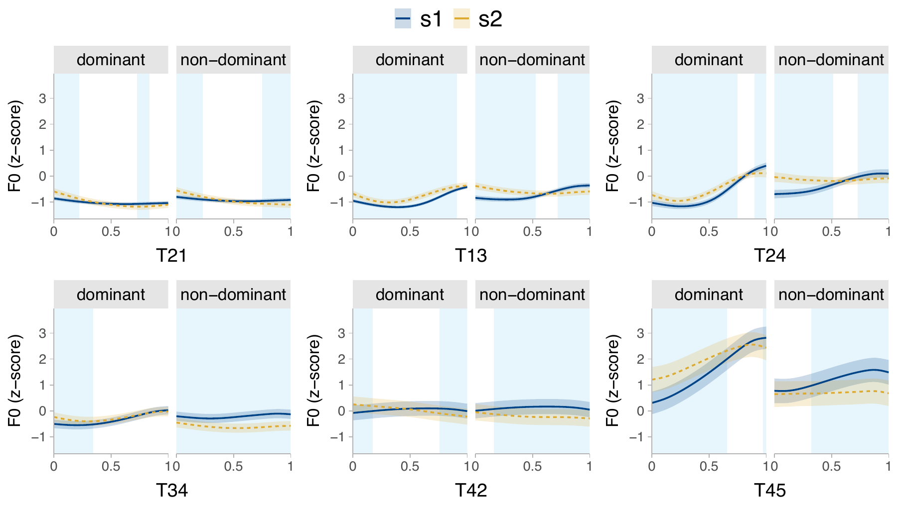{fig-align="center"}

## Findings on tonal production I

- In dominant syllables,
    - T21 and T42 exhibit a slightly **smaller falling** in s1.
    - The rising tones (T13, T24, T34, and T45) show a rising contour only in s1.
- In non-dominant syllables, 
    - T21 and T42 show a slightly **smaller falling** in s1.
    - The rising tones (T13, T24, T34, and T45) are more or less leveled in s2.

## GAMM results on tonal production

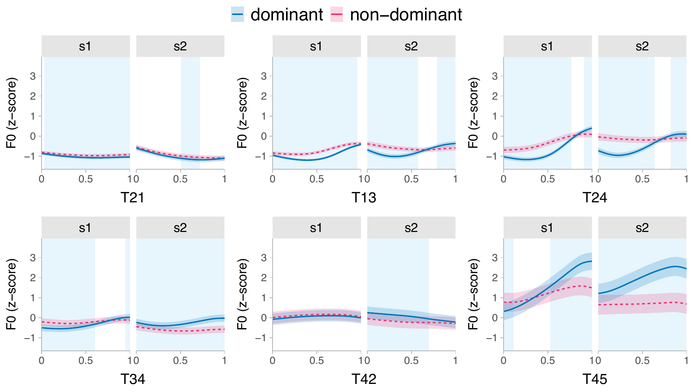{fig-align="center"}

## Findings on tonal production II

- In s1,
    - In dominant syllables, T21 and T13 are entirely lower.
    - The other rising tones (T24, T34, and T45) show a **steeper** rising contour in dominant syllables.
    - T42 is unaffected.
- In s2, 
    - T21 reaches a **lower** F0 minumum in dominant syllables.
    - T13, T24, T34 and T45 show **rising** contour only in dominant syllables. 

## Overall tone contours

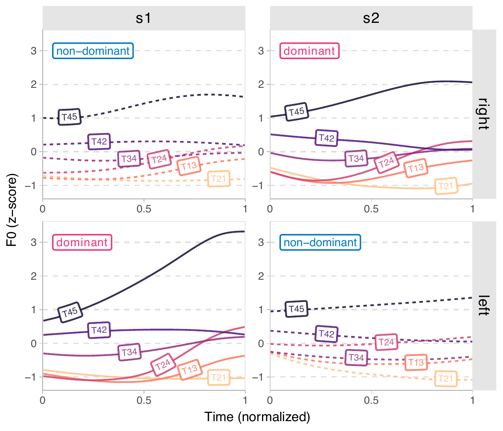{fig-align="center"}

## GAMM results on anticipatory coarticulation

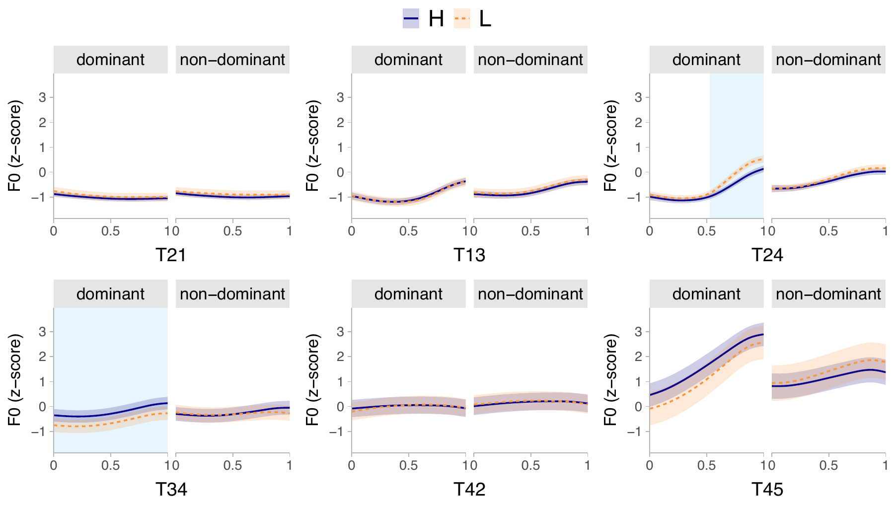{fig-align="center"}

## GAMM results on carryover coarticulation

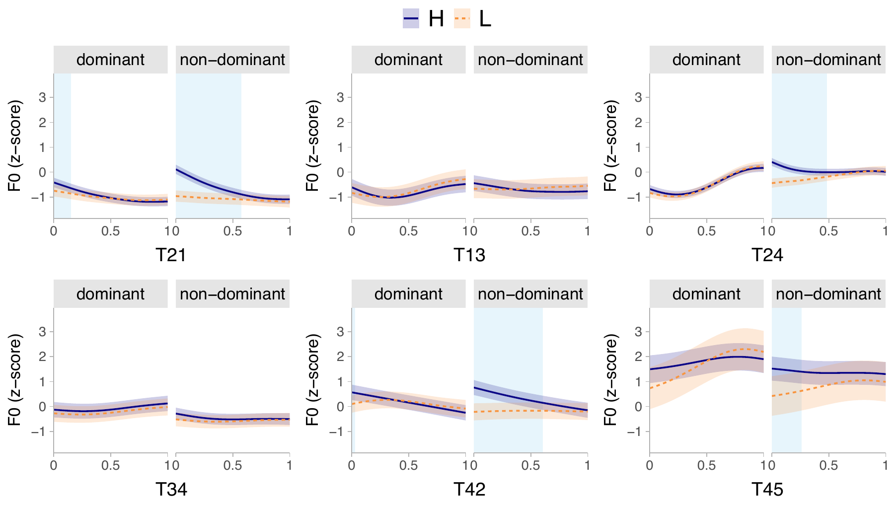{fig-align="center"}

## Findings on coarticulation

- Anticipatory coarticulation only occurs for T24 and T34. It is more prominent in dominant syllables.
- Carryover coarticulation observed for T21, T24, T42, and T45 tones, but is more extensive in non-dominant syllables.

## LDA results

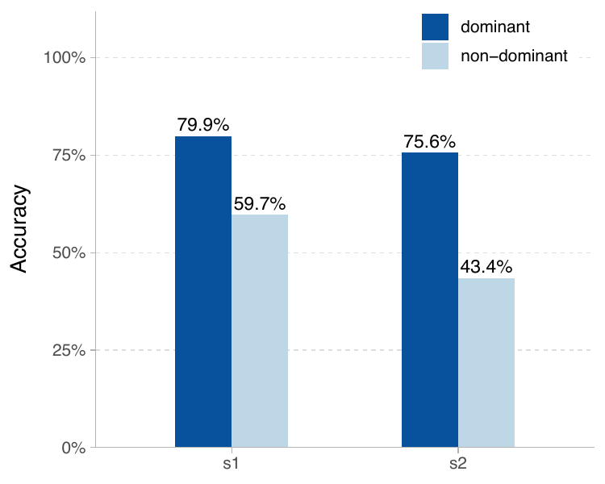{fig-align="center"}

## LDA results

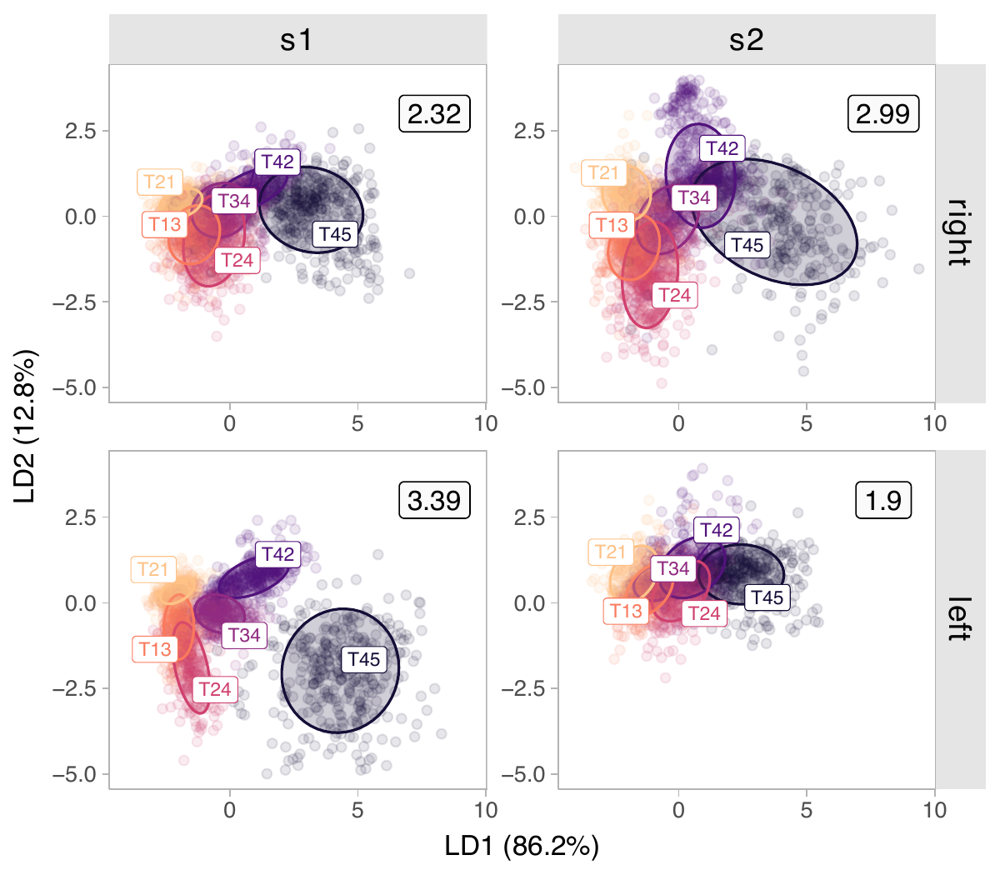{fig-align="center"}

## LDA results

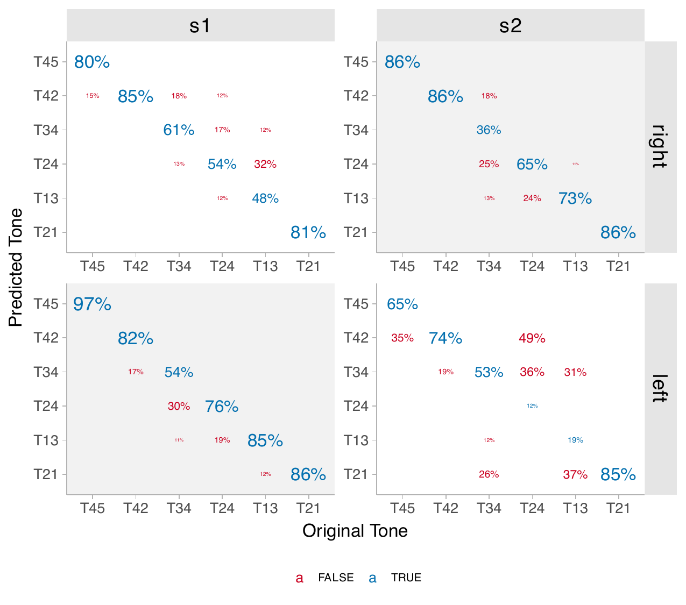{fig-align="center"}

## Findings in LDA analysis

- Prediction accuracy is higher in dominant syllables.
- In final non-dominant syllables, the prediction accuracy of T13 and T24 becomes very low (chance level is 16.7%), suggesting tonal merging.
- Initial non-dominant syllables behave similarly to dominant syllables, although the prediction accuracy is lower, probably due to less distinct F0 contours as a consequence of short duration.

# Discussion

## How does tone sandhi affect duration?

- Dominant syllables are longer than non-dominant syllables (~ 100ms), consistent with the metrical prominence of the dominant syllables.

## How does tone sandhi affect tonal production?

- Contour tones retain their contour not only in dominant syllables, but also in initial non-dominant syllables, while the slope of the contour differs.
- Final non-dominant syllables show significantly less F0 excursion, indicating tonal leveling.
- LDA analysis suggests T13 and T24 do lose their tonal identity, yet the picture is more complex than categorical merging.

## How does tone sandhi affect tonal coarticulation?

- Only the carryover effect is extensively influenced by tone sandhi.
- Non-dominant syllables show more carryover coarticulation than dominant syllables.

## Asymetric tone sandhi

- Left- and right-dominant tone sandhi in Changsha Xiang is asymmetric. 
- *Paradigmatic neutralization* [@zhangDirectionalAsymmetryChinese2007] is only found in the final non-dominant syllables, while those in initial non-dominant syllables only undergo tonal undershoot, with less F0 excursions than in dominant syllalbes due to short duration.

## Asymetric tone sandhi

This is Similar to the Shanghai Wu tone sandhi, which is also asymetric:

- Shanghai Wu **left-dominant** tone sandhi: the tone spreads from the initial syllable to the final syllable.
- Shanghai Wu **right-dominant** tone sandhi: a pattern called *paradigmatic neutralization* [@zhangDirectionalAsymmetryChinese2007].
    - Paradigmatic neutralization: some default surface tones are inserted. 
    - They are the four short-level tones (T2-5) in Changsha Xiang.

## Asymetric tone sandhi

A similar pattern was found in Chongqing Mandarin [@qingAnalysisDisyllabicTone2014] as well.

- Only non-dominant syllablers demonstrate tonal leveling. 
    - E.g., T35 -> T33 when in non-dominant syllables.
- Tones in dominant syllables can largely retain their underlying contours.

## The possible cause of the asymmetry

Scenario 1:

- The right-dominant tone sandhi is reusing a sandhi process for phrasal tonologly.
- There might have been a word boundary between the two syllables.
- Tones adjacent to a stronger boundary (word or phrase) are less likely to lose their tonal identity.

## The possible cause of the asymmetry

Scenario 2:

- The non-dominant syllable in right-dominant disyllables are word-initial.
- Word-initial position has in general been considered a prosodically strong position such that it blocks tonal neutralization.
- More data on tones in the word-initial syllables in Changsha Xiang multisyllabic words are needed to test this hypothesis.

## Typology of tone sandhi in Sinitic languages

- Paradigmatic neutralization is usually found in right-dominant tone sandhi [@zhangDirectionalAsymmetryChinese2007; @zhangTonesTonalPhonology2014].
- In Changsha Xiang, it is the **left-dominant** tone sandhi that shows paradigmatic neutralization.
- A typological hypothesis (in the context of Sinitic languages): In terms of the degree of grammaticalization: tonal spreading > paradigmatic neutralization > tonal undershoot.

## Possible tone-stress interaction?

Multiple evidence suggests that the tone sandhi in Changsha Xiang may reflect metrical prominence at the word level:

- Dominant syllables are much longer than non-dominant syllables, and have more distinct tonal production than non-dominant syllables.
- Non-dominant syllables show more tonal coarticulation than dominant syllables.

More research, both phonetic and phonological, is needed to establish stress in Changsha Xiang.

# Conclusion

Tone sandhi in Changsha Xiang is asymmetric, involving paradigmatic neutralization only in the final non-dominant syllables. This process may reflect metrical prominence at the word level, with dominant syllables being longer and having more distinct tonal production than non-dominant syllables. Further studies that investigate how other acoustic measures are influenced by tone sandhi are needed.

## References

::: {#refs .references}
:::