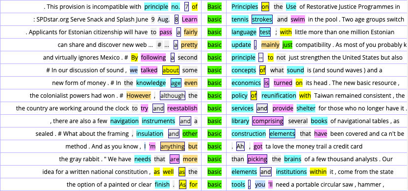

# Session 1: What is a corpus?

## What makes a text collection a corpus rather than just a pile of texts? { .question-slide }

Could a text collection (all newspaepr archives of a country in a decade) be a corpus? 

Why or why not?

## A corpus is **MORE** than a collection

A corpus is:

- large enough to be useful
- systematic and organized
- machine-readable
- designed for analysis
- representative of a language variety or purpose

## Discussion { .question-slide }

Imagine you want to study L2/3 English produced by undergraduate students at MUST.

What would you include in a corpus to make it representative?

Be ready to explain your choices.

## What is not a corpus?

- a dictionary or word list
- a text archive
- a quotation collection
- one book or one article
- a random internet dump

## Why corpora matter

Even expert speakers:

- do not know everything
- may be biased by what they notice
- cannot remember every pattern
- cannot easily quantify language use

# Session 1: features of a corpus

## What constitutes a GOOD corpus? { .question-slide }

If your corpus contains only formal essays, what kinds of language might be missing?

- Think about a research question you might want to ask about English in general.
- What kind of corpus would you need to answer it? What characteristics would it have?

Think about speech, conversation, and informal writing.

## 1. Representativeness

A corpus should represent the language variety it studies.

If the sample is not balanced, the findings may be misleading.

## 2. Finite size

- a corpus is usually limited in size
- it has a target or design
- it stops when the collection goal is reached

Why is this important for corpus?

## 3. Machine-readable format

- searchable
- analyzable by computer
- suitable for concordancing and statistics

## Concordancing (also known as KWIC: Key Word In Context)

## 4. Standard reference

A good corpus can be reused by other researchers.

It gives a stable source for comparison.

- Replicability: other researchers can repeat the study

## Which of these is most corpus-like? { .question-slide }

- a dictionary
- posts on X worldwide within a certain year.
- Youtube closed captions for a certain year.
- Bilibili Danmaku.

Explain your answer.

# Session 2: Why do we use corpora?

## What can a corpus reveal that intuition alone cannot? { .question-slide }

Try to give one example from writing, speaking, or learning.

An example of intuition: "In English, we say 'I don't go somewhere.' instead of 'I go not somewhere.'"

## Why use corpus?

A corpus helps us:

- test patterns in real data
- compare language varieties
- study typical and rare usage
- support claims with evidence

## What a corpus cannot do

## Can a corpus prove that a form is impossible in English? { .question-slide }

Why might corpus evidence still be incomplete?

## Limitations of corpus data

:::{.incremental}
- There is no negative evidence in a corpus.
- Absence of evidence is not evidence of absence.
- Corpora show patterns, but they do not explain everything.
- Findings depend on the corpus and the research question.
:::

# Session 3: Corpus linguistics as a method

## Debate question { .question-slide }

Is knowledge about **language** best built from observation or from reasoning?

Choose a side and defend it briefly.

## Empiricism vs. rationalism

| Dimension | Empiricism | Rationalism |
|-----------|------------|-------------|
| Source of data | external evidence | internal reasoning |
| Example task | frequencies/probability | grammaticality judgement |
| Goal | description | explanation |
| Strength | objective and testable | can access rare possibilities |

## Chomsky's critique

## Question { .question-slide }

If a speaker makes an error, does that mean the rule is absent from the language?

Why or why not?

## 1. Performance vs. competence

Speakers do not always produce ideal language.

Errors may be caused by fatigue, stress, distraction, or memory limits.

## 2. Lack of representativeness

A corpus is only a sample.

A small or biased corpus may miss important patterns.

## 3. Negative evidence

A corpus may never show everything.

The absence of an example does not mean the form is impossible.

## 4. Unanalyzable size

Even huge corpora are too large for full manual analysis.

That is why computational tools matter.

## Of the four critiques, which do you think is the most serious? { .question-slide }

1. Can only analyze performance, not competence
2. Lack of representativeness
3. Lack of negative evidence
4. Too large to analyze

## Corpus linguistics responds

:::{.incremental}
1. Corpora are now massive and computational tools handle large data.
2. Good corpus design records speaker and text characteristics.
3. Most corpus work tests hypotheses rather than replacing theory.
4. Experimental methods can complement corpus findings.
:::

# Session 4: How do researchers work with corpora?

## Class decision { .question-slide }

If your goal is to study what is common in real language use, should you choose:

- a corpus study?
- an experiment?

Explain your choice.

## Basic corpus tools

1. Concordancers
   - show all examples of a word with context
2. Aligners
   - compare parallel texts (for translation studies)
3. POS taggers
   - assign grammatical categories
4. Parsers
   - analyze structure and function

## The evolution of corpora

- 1960s: Brown Corpus
- 1980s: scanner era
- 1990s: digitization
- 2000s-present: internet-scale data

## Quantitative vs. qualitative

## Quick comparison { .question-slide }

When would you prefer a qualitative method, and when would you prefer a corpus-based quantitative one?

Compare research goals and data types.

## Qualitative study

- aim: depth and context
- sample: small and purposeful
- method: interviews, case studies, observation
- strength: rich detail
- weakness: limited generalization

## Quantitative study

- aim: patterns and frequency
- sample: large and systematic
- method: counts and statistics
- strength: objective and generalizable
- weakness: less nuanced context

# Corpus design and research questions

## Design challenge { .question-slide }

You want to study how social media English changes over time.

Which type of corpus would be most useful: a sample corpus or a monitor corpus?

- A reminder: a monitor corpus is a corpus that continues to grow over time, while a sample corpus is fixed and collected at one time.

## Types of corpora

## Sample vs. monitor

- sample corpus: fixed, collected at one time
- monitor corpus: continues to grow over time

## General vs. specialized

- general: broad language picture
- specialized: one genre, group, or domain

## Written vs. spoken

- written: books, articles, essays
- spoken: interviews, conversations, meetings

## Raw vs. annotated

- raw: unprocessed text
- annotated: tagged or labeled text

## Final reflection { .question-slide }

What kind of research question would you ask if you had access to a large corpus?

Write one idea you could investigate.

## Popular online corpora

[english-corpora.org](https://www.english-corpora.org/)

The most popular ones:

- COCA, BNC, COHA, GloWbE, Oxford English Corpus, NOW (News on the Web) Corpus, etc.

## You can build your own corpus!

[Sketch Engine](https://sketchengine.eu/) is a commercial tool for building and analyzing corpora.

## Journals of Corpus Linguistics

[Corpora](https://www.euppublishing.com/loi/cor), [Corpus Pragmatics](https://link.springer.com/journal/41701), [Corpus Linguistics and Linguistic Theory](Corpus Linguistics and Linguistic Theory), [Digital Scholarship in the Humanities](https://academic.oup.com/dsh), [ICAME Journal](https://content.sciendo.com/view/journals/icame/icame-overview.xml), [International Journal of Corpus Linguistics](https://www.benjamins.com/catalog/ijcl), [International Journal of Learner Corpus Research](https://benjamins.com/catalog/ijlcr), [Journal of Corpora and Discourse Studies](https://jcads.cardiffuniversitypress.org/), [Applied Corpus Linguistics](https://www-sciencedirect-com.libezproxy.must.edu.mo/journal/applied-corpus-linguistics)

## Takeaway

Corpus linguistics is a method for studying real language with evidence.

It helps us move from intuition to investigation.

And that is the foundation of corpus-based research.
